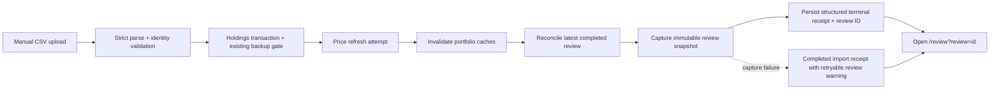
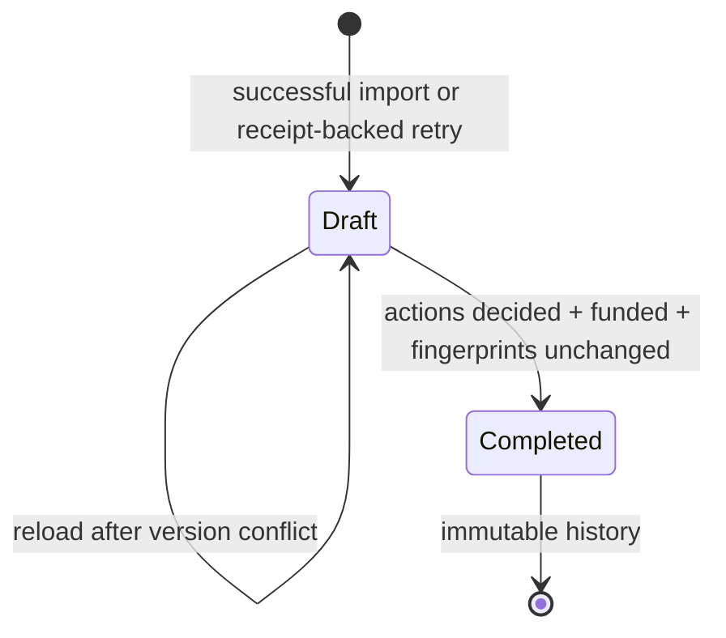
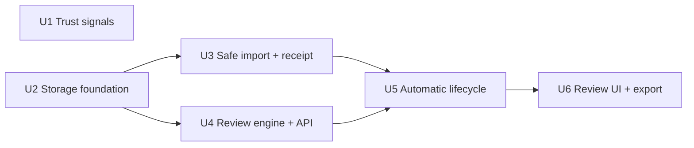

# Trusted Monthly Decision Review - Plan

## Goal Capsule

- **Objective:** Turn each successful manual portfolio import into a trustworthy, resumable monthly review that explains what changed, surfaces allocation exceptions, recommends buy/sell actions through the existing rebalancer, reconciles cash, and preserves decisions for the next review.
- **Product authority:** the user, who runs the YNAB -> IBKR -> Parqet -> Prismo workflow once a month.
- **Scope authority:** implement the full workflow-hardening and monthly-decision-brief directions; do not add investment-thesis memory.
- **Execution profile:** six sequenced units, no new dependencies, one SQLite review aggregate, one Review page, and focused pure-function/API tests.
- **Tail ownership:** standalone implementation, verification, browser QA, and review.
- **Stop conditions:** no product blocker remains. During implementation, follow `AGENTS.md`: run GitNexus impact analysis before editing every existing symbol and stop for the user if any edit is HIGH or CRITICAL risk.

---

## Product Contract

### Summary

Harden Prismo's existing manual import and decision inputs, then add one compact monthly Review page. A successful import creates a point-in-time draft; the user reviews changes, readiness, breaches, and ranked actions, records decisions, exports accepted actions, and completes an immutable review that the next import can reconcile.

### Problem Frame

The current monthly chain ends with data in Prismo but not with a decision record. The Overview can misread persisted rules, the masthead labels the wall clock as live data, and CSV progress can be served from a 30-second cache. The import pipeline already computes a useful receipt, but the background job replaces it with a generic success string. There is no durable review, comparison baseline, action history, or next-import reconciliation.

The valuable calculation engine already exists. The backend supports the three capital modes and produces position-level EUR actions, while the portfolio repository exposes canonical values and effective shares. This plan connects those pieces around a frozen monthly snapshot instead of building a second allocation engine or a transaction ledger.

### Product Decisions

- Build workflow hardening and the monthly decision review together; do not build qualitative thesis memory.
- Keep YNAB, IBKR, and Parqet interaction manual. Prismo receives a CSV and a manually entered monthly contribution; it does not retrieve IBKR Flex reports or place trades.
- Treat a review as a decision snapshot, not accounting attribution. Parqet remains authoritative for transactions, dividends, fees, taxes, and performance accounting.
- Keep the review on one page. Do not introduce a wizard, event-sourced workflow, separate import-run model, or generalized action framework.

### Requirements

#### Trustworthy portfolio inputs

- R1. Overview must evaluate the five persisted allocation rules (`maxPerStock`, `maxPerETF`, `maxPerCrypto`, `maxPerCategory`, and `maxPerCountry`) against canonical current values and effective country data; cash stays outside the allocation denominator.
- R2. The masthead must show the timestamp and state of the latest portfolio valuation, not label the current wall clock as live market data.
- R3. CSV parsing must reject ambiguous formats, unknown transaction types, and unresolved holding-identity collisions rather than silently interpreting them as Parqet rows, buys, or updates.
- R4. Imports must match a normalized/preferred identifier first, then a unique source-compatible name; filtered or skipped rows and all protection counts must appear in the receipt.
- R5. CSV progress must poll an explicit account-owned job without client or browser caching, never infer completion from `idle`, reject a second active CSV import for the same account, and surface an interrupted job after a server restart.
- R6. A completed CSV job must retain a structured receipt containing source format, mode, filename, added/updated/removed holdings, skipped/protected counts, price failures, warnings, completion time, and the created review ID when available.

#### Monthly review lifecycle

- R7. After holdings and price-refresh attempts finish, a successful import must create a review draft idempotently and open it; a failed import creates no review.
- R8. If draft creation fails after holdings were committed, the import remains successful and offers an idempotent retry from the completed receipt.
- R9. Each draft must freeze the structured import-result receipt before job-finalization metadata is attached, plus enriched holdings, effective shares, current values, targets, rules, current account cash, price/FX timestamps, and the server allocation tree used to produce recommendations. The terminal job receipt later adds the created review ID or `review_creation: failed`; it does not mutate the frozen draft receipt.
- R10. The first review must identify itself as a baseline. Later reviews compare with the latest completed review and show added/closed/renamed/moved positions, share/cash/value/allocation changes, target/rule changes, and new/resolved breaches.
- R11. Draft edits must be versioned and account-scoped. A stale tab receives a conflict instead of overwriting newer decisions, and a completed review is immutable.
- R12. The Review page must resume the newest draft by default and keep older drafts and completed reviews accessible in the same history selector.

#### Readiness, decisions, and execution

- R13. Recommendation readiness must block when there are no positive holdings, no usable portfolio targets, a positive holding lacks an authoritative valuation, or required FX is missing/approximate; stale but usable prices/rates and failed refreshes are visible warnings.
- R14. The user may explicitly continue past a blocking readiness warning, and the override must be stored in the draft and shown in the completed review.
- R15. Recommendations must reuse the existing backend capital modes: existing capital only, new capital only, and new capital with sales. New-capital modes use snapshotted account cash plus a manually entered YNAB contribution that defaults to EUR 0 and represents only cash not already included in that snapshot; existing-only injects no cash.
- R16. Breaches must be ranked by percentage-point excess and include their largest contributors. Buy and sell actions must be ranked by absolute EUR amount with deterministic name tie-breaking.
- R17. Concrete recommendations must come from the existing server rebalancer. Placeholder target slots and holdings missing the inputs required for an executable estimate are shown as unresolved gaps and link back to Plan rather than becoming fake securities.
- R18. Every actionable row must be accepted, deferred, dismissed, or adjusted before completion. An adjusted action is accepted with an overridden EUR amount; each row may carry one optional review-local note.
- R19. Changing capital mode or monthly contribution must recompute from the frozen snapshot. A prior decision survives only when its deterministic action key, side, and rounded amount are unchanged; otherwise it returns to undecided.
- R20. Completion must recheck a live fingerprint of every mutable recommendation input: effective holdings, targets, allocation rules, and account cash. If any changed since capture, completion stops and asks the user to start a fresh draft rather than freezing stale instructions; market prices and FX remain intentionally frozen estimates, while the draft's contribution is protected by optimistic versioning.
- R21. The cash summary must reconcile current cash, not-yet-deposited monthly contribution, accepted sales, accepted buys, and remaining cash. Completion must remain blocked while accepted/adjusted actions produce negative remaining cash. The summary must not write predicted cash back to the account.
- R22. Export must produce one spreadsheet-safe CSV checklist from persisted accepted/adjusted rows, including security, identifier, portfolio, side, final EUR amount, estimated units, snapshot price/time, post-action allocation, note, and review ID. Text cells beginning with `=`, `+`, `-`, `@`, tab, or carriage return must be neutralized, and numeric cells must be emitted only from validated numeric values.

#### History and next-import follow-up

- R23. Completing a review freezes its snapshot, comparison, warnings, decisions, cash reconciliation, and pending set; dismissed actions are closed, while accepted/adjusted/deferred actions remain available for follow-up.
- R24. The next successful import must compare effective-share movement against the latest completed review: expected-direction movement may be suggested as observed/partial, unchanged remains pending, deferred carries forward, and ambiguous identities require confirmation.
- R25. Reconciliation must prefer normalized identifier plus portfolio and fall back only when source/name/portfolio is unambiguous. It must never infer execution from market-value or price movement.
- R26. Review comparisons and reconciliation must state that they are best-effort snapshot analysis, not transaction or tax accounting.

### Key Flows

- F1. **Import to draft:** upload CSV -> strict validation -> holdings commit -> price refresh attempt -> portfolio cache invalidation -> structured receipt -> reconcile prior pending actions -> capture draft -> terminal poll opens Review.
- F2. **Review to completion:** resume draft -> inspect receipt/readiness/changes -> select mode and monthly contribution -> decide every action -> reconcile cash -> export if desired -> fingerprint check -> complete immutable review.
- F3. **Next month:** import new data -> create a new draft linked to the latest completed review -> show snapshot changes and reconciliation suggestions -> user confirms the new plan.
- F4. **Recoverable handoff:** import succeeds but review capture fails -> terminal receipt shows the failure -> Review page retries the same account/job association -> unique source-job linkage prevents a duplicate draft.

### Acceptance Examples

- AE1. **Covers R3-R8.** A valid Parqet import completes with a structured receipt and review ID, invalidates cached holdings before capture, and opens the corresponding draft. Re-polling the terminal job returns the same receipt and draft.
- AE2. **Covers R3-R6.** An ambiguous CSV, unknown transaction type, or same-name/different-identifier collision fails before holdings mutation; an intentionally filtered IBKR cash row appears as a warning instead of disappearing into logs.
- AE3. **Covers R2, R5.** Progress advances on consecutive polls despite the normal 30-second API cache, `idle` never produces a false success, and the masthead displays the actual latest valuation age.
- AE4. **Covers R9-R12.** The first completed review says “Baseline”; a second review shows a new position, a closed position, a share change, a cash change, a changed rule, and a resolved breach while the first review remains unchanged.
- AE5. **Covers R13-R14.** A holding valued through approximate fallback FX blocks actions and names the affected holding/currency. The user can store an explicit override; stale but authoritative data warns without being mislabeled as current.
- AE6. **Covers R15-R17, R21.** With EUR 500 account cash and EUR 1,000 not-yet-deposited contribution, new-only plans against EUR 1,500 with no sales; if the EUR 1,000 was already deposited and is present in snapshotted cash, the contribution stays at its EUR 0 default so it is not counted twice. New-with-sells adds accepted sale proceeds; existing-only injects EUR 0 and keeps cash separate.
- AE7. **Covers R18-R21.** Changing the contribution alters an action amount and resets its decision. Completion remains blocked until every action is decided, accepted/adjusted actions leave non-negative remaining cash, and the live fingerprint confirms effective holdings, targets, rules, and account cash are unchanged.
- AE8. **Covers R22-R23.** The exported CSV contains only persisted accepted/adjusted actions and matches the completed review's cash totals; deferred and dismissed rows do not appear as execution instructions. Formula-like security/note text is neutralized, while invalid numeric values fail export rather than becoming spreadsheet cells.
- AE9. **Covers R24-R26.** On the next import, an accepted buy with a smaller same-direction share increase is “partial,” no share change stays pending, a deferred action carries forward, and a duplicate identifier across portfolios is marked ambiguous rather than executed.
- AE10. **Covers R8, R11-R12.** A review-capture failure does not convert a successful import into a failed import; retry creates one draft, while stale-tab PATCH requests return a conflict and cannot overwrite it.

### Scope Boundaries

**Included:**

- Manual Parqet and IBKR CSV safety, truthful progress/receipts, allocation-rule correctness, real valuation freshness, monthly review persistence, comparison, recommendations, cash reconciliation, action decisions, CSV export, history, and next-import reconciliation.

**Outside scope:**

- Investment-thesis rationale, conviction, invalidators, evidence links, news/research feeds, or automated risk opinions.
- IBKR Flex retrieval, YNAB integration, Parqet integration, broker API access, or direct trade placement.
- Accounting-grade transaction attribution, tax lots, fees, dividends, tax calculations, or replacing Parqet.
- A separate import-runs table, normalized review-action table, event sourcing, workflow engine, or new dependency.
- A multi-step import-preview wizard. Unsafe input fails with a useful receipt/error; expected filtered rows are reported.
- Simulator redesign or broad Plan refactoring. Review links unresolved targets to the existing Plan page.

### Dependencies

- SQLite remains the durable store; JSON payloads follow the existing simulation-persistence precedent.
- The current server rebalancer remains the sole capital-mode engine.
- Market prices and FX remain latest-value stores, so completed reviews must snapshot their values and timestamps.
- Browser behavior that cannot be covered by the repository's Node-only Vitest setup requires focused manual QA.

---

## Planning Contract

### Key Technical Decisions

- KTD1. **One versioned review aggregate.** Add one `monthly_reviews` table whose JSON payload contains the immutable snapshot, comparison, reconciliation, recommendations, and draft decisions. Do not use `expanded_state`, a normalized action table, or an event log. `(session-settled: user-directed — chosen over generalized workflow/thesis storage: the user asked for a simple monthly decision record.)`
- KTD2. **Extend `background_jobs` instead of adding `import_runs`.** Add account ownership and persist the terminal CSV receipt as JSON. Copy the structured import-result receipt into the review snapshot before job-finalization metadata is attached; after the creation attempt, the terminal job receipt adds `review_id` or `review_creation: failed`. The existing job ID is the idempotency key. `(session-settled: user-approved — chosen over automated IBKR retrieval and a second import model: manual CSV remains the workflow boundary.)`
- KTD3. **Point-in-time snapshots, not live reviews.** Recommendations, diffs, and exports operate on captured holdings, targets, rules, cash, prices, and FX. Completion fingerprints every mutable recommendation input—effective holdings, targets, rules, and account cash—while prices and FX remain frozen estimates; meaningful live changes create a fresh draft rather than mutating history.
- KTD4. **Reuse the backend plan engine.** Promote the current internal allocation-tree composer into a shared service and call `rebalance_service` for all three modes. Review code flattens its detailed position actions; it does not port or duplicate the math in TypeScript.
- KTD5. **Cash is separate from allocation.** Allocation percentages and breaches use invested holdings only. Account cash plus a manual YNAB contribution becomes deployable capital only in the two new-capital modes; that contribution defaults to EUR 0 and means cash not already present in the frozen account-cash snapshot. Predicted remaining cash is review output, not account state, and an underfunded accepted plan cannot complete. `(session-settled: user-directed — chosen over a YNAB integration: the monthly amount is carried into Prismo manually.)`
- KTD6. **Two persisted states only.** A review is `draft` or `completed`; readiness and reconciliation are derived payload fields. Optimistic integer versions prevent multi-tab lost updates. Multiple drafts may exist, with the newest resumed by default.
- KTD7. **Share-direction reconciliation is advisory.** Match by normalized identifier plus portfolio when unique, compare effective units, and classify observed/partial/pending/ambiguous. Never use value movement as execution evidence and never mutate the prior completed review.
- KTD8. **One Review page and one CSV export.** Use a single scrollable page with a history selector and simple sections; no wizard, separate history page, PDF generator, or trading integration. `(session-settled: user-directed — chosen over a broader research/trading workspace: the user requested all three decisions in one elegant monthly brief.)`

### High-Level Technical Design

#### Import-to-review data flow

The holdings transaction keeps its existing pre-import backup behavior. Price failures remain non-fatal but are captured as readiness warnings. Cache invalidation moves before snapshot capture so memoized allocation and enriched-holdings reads cannot freeze pre-import data into the review.

#### Review lifecycle

A new import creates a new draft; it does not rewrite or delete an older draft. The Review navigation resumes the newest draft, while the history selector exposes the rest.

#### Minimal persistence shape

| Field | Purpose |
|---|---|
| `id`, `account_id` | Account-scoped review identity |
| `source_job_id` | Nullable CSV job link; unique per account for idempotent recovery |
| `period`, `previous_review_id` | Monthly label and latest-completed comparison anchor |
| `status`, `version` | `draft`/`completed` lifecycle and optimistic concurrency |
| `payload` | Versioned JSON containing receipt, snapshot, readiness, diff, reconciliation, inputs, actions, decisions, notes, and cash summary |
| `created_at`, `updated_at`, `completed_at` | History ordering and immutability evidence |

The JSON starts with `payload_version: 1`. API serializers validate required keys before persistence; clients cannot replace the immutable snapshot through PATCH.

### System-Wide Impact

- **Data lifecycle:** fresh installs and upgrades need schema and migration changes. Account deletion and full account-data replacement must remove review history.
- **Authorization:** job and review reads/writes always filter by `g.account_id`; knowing another account's ID or UUID is insufficient.
- **Caching:** import invalidation happens before snapshot capture. Review-only writes are excluded from broad portfolio-data invalidation on both Flask and frontend cache layers.
- **Concurrency:** one active CSV job per account; review PATCH/complete uses optimistic version checks; terminal job reads remain repeatable.
- **Performance:** reviews are monthly and payloads are bounded by current holdings, so one JSON aggregate avoids unnecessary joins and action-table machinery.
- **Compatibility:** existing Plan, Simulator, account cash, destructive-import backup, and background price jobs retain their public behavior.

### Implementation Constraints

- No network call is added to review creation. It evaluates the import's stored price attempt and current stored data.
- No recommendation may invent a security for a placeholder target slot.
- All monetary results remain labeled estimates; share quantities are derived from the snapshotted EUR unit price and rounded only for display/export.
- Completed review payloads are never recomputed in place.
- Parser safety changes must preserve intentional IBKR filtering while making it visible in the receipt.
- CSV export must neutralize formula-like text and reject non-numeric values in numeric columns before serialization.
- Completion controls must be keyboard-operable, expose semantic labels and relationships, show visible focus, announce save/error states, and provide an accessible path to the first undecided action.
- Before changing existing functions/classes, the executor must run the GitNexus upstream impact required by `AGENTS.md`; after implementation, run `gitnexus_detect_changes`/CLI equivalent before any commit.

### Sequencing

U1 is independent and may land before or alongside the storage chain. U2 owns migration 24 so later units do not compete over schema versioning.

### Risks and Mitigations

- **Import identity ambiguity:** identifier-first matching can still meet duplicate identifiers or portfolio moves. Block unsafe import updates and mark reconciliation ambiguous rather than guessing.
- **Corporate actions:** splits, transfers, and renames can resemble execution. Reconciliation is advisory and requires confirmation for ambiguous cases.
- **Stale snapshot:** Plan/Enrich edits or account-cash changes after capture could invalidate actions. The effective-holdings/targets/rules/cash fingerprint blocks completion and sends the user to a fresh draft; frozen price/FX movement does not create a false conflict.
- **Underfunded decisions:** dismissing a supporting sale while accepting its buys can make the action set impossible. Server-side completion validation requires non-negative remaining cash.
- **Spreadsheet execution:** user-controlled labels or notes can be interpreted as formulas. Export neutralizes formula-like text and admits only validated numbers into numeric columns.
- **Background-process restart:** daemon CSV work cannot resume. Startup marks inherited processing CSV jobs interrupted; the UI reports this truthfully.
- **Payload growth:** snapshots duplicate monthly holdings. The intended personal/monthly scale is small; if measured storage becomes material later, normalization can be evaluated with evidence.
- **Migration safety:** schema tests cover both fresh DDL and v23 -> v24 upgrade, and existing pre-import backup behavior remains unchanged.

---

## Implementation Units

### U1. Correct allocation rules and show real valuation freshness

- **Goal:** Make existing decision surfaces truthful before adding the monthly review.
- **Requirements:** R1, R2.
- **Dependencies:** none.
- **Files:** `frontend/src/types/overview.ts`; `frontend/src/lib/overview-calc.ts`; `frontend/src/hooks/use-overview.ts`; `frontend/src/app/(dashboard)/page.tsx`; `frontend/src/components/ptsim/Masthead.tsx`; `frontend/src/lib/staleness.ts`; `frontend/src/lib/__tests__/overview-calc.test.ts`; new `frontend/src/lib/__tests__/staleness.test.ts`.
- **Approach:** Align Overview with the persisted five-key `AllocationRules` contract. Replace the generic “stock” grouping with position-limit violations that choose `maxPerStock`, `maxPerETF`, or `maxPerCrypto` from each holding's `investment_type`; use `maxPerCategory` for sectors while accepting legacy `maxPerSector` during hydration; use `effective_country`; preserve holdings-only denominators. Update the three Overview panels to Position/Sector/Country and count all configured rules in health state. In Masthead, fetch the existing `/portfolio_metrics` response through `useApiQuery`, parse `last_update`, and feed a pure classifier. Replace wall-clock `LIVE` with `CURRENT · EUR · <valuation time>` for data no older than the 24-hour price interval, `STALE · <age>` when older, and `NO VALUATION DATA` when absent. Keep the displayed timestamp stable during SSR.
- **Patterns to follow:** canonical values in `frontend/src/lib/position-value.ts`; timestamp parsing in `frontend/src/lib/enrich-calc.ts`; pure calculation tests in `frontend/src/lib/__tests__/overview-calc.test.ts`; existing `LiveDot` levels.
- **Test scenarios:** Stock/ETF/Crypto each use their own cap; `maxPerCategory` produces sector breaches; legacy `maxPerSector` still reads; effective country overrides raw country; cash does not change percentages; all/no/some rules produce correct health. Fresh/stale/missing/invalid/future timestamps produce deterministic labels using an injected `now`.
- **Verification:** `cd frontend && npm test -- overview-calc staleness`; `npm run typecheck`; visually confirm Masthead and Overview against a known valuation timestamp.

### U2. Add the minimal account-scoped persistence foundation

- **Goal:** Provide durable import ownership and one versioned review aggregate without introducing a workflow subsystem.
- **Requirements:** foundation for R5-R12, R23-R25.
- **Dependencies:** none.
- **Files:** `app/schema.sql`; `app/db_manager.py`; new `app/repositories/monthly_review_repository.py`; `app/repositories/account_repository.py`; `app/routes/portfolio_account_api.py`; new `tests/test_monthly_review_repository.py`; new `tests/test_db_migrations.py`.
- **Approach:** Add nullable `account_id` plus an account/status index to `background_jobs`; CSV jobs populate it, while existing global price jobs may remain null. Add `monthly_reviews` with the minimal fields in the persistence table above, a `CHECK` for draft/completed, unique `(account_id, source_job_id)`, account/status/date indexes, and account deletion semantics. Bump `LATEST_VERSION` from 23 to 24, perform both changes idempotently, and add the table/column to `verify_schema()`. Implement repository methods for list summaries, newest draft, latest completed, account-scoped get, idempotent create, version-checked draft update, and transactional completion. Update both account-deletion paths and full account-data replacement; legacy account imports clear reviews so replacement holdings cannot compare with old snapshots.
- **Patterns to follow:** JSON CRUD and account filters in `app/repositories/simulation_repository.py`; schema + inline migration pairing in `app/schema.sql` and `app/db_manager.py`; real temporary SQLite setup in `tests/conftest.py`.
- **Test scenarios:** fresh schema has the new column/table/indexes; a v23 database migrates once to v24; repeated migration is a no-op; duplicate account/job creation returns the same review; another account cannot read/update/complete it; stale version update fails; completed update fails; newest draft/latest completed ordering is deterministic; account delete and account-data replacement remove reviews.
- **Verification:** `./test.sh backend` with the focused repository/migration tests green.

### U3. Make CSV imports strict, account-owned, and receipt-driven

- **Goal:** Ensure the monthly review starts from a truthful import result.
- **Requirements:** R3-R6.
- **Dependencies:** U2.
- **Files:** `app/utils/csv_processing/parser.py`; `app/utils/csv_processing/company_processor.py`; `app/utils/csv_processing/transaction_manager.py`; `app/utils/portfolio_processing.py`; `app/utils/batch_processing.py`; `app/routes/simple_upload.py`; `frontend/src/lib/api.ts`; `frontend/src/app/(dashboard)/enrich/csv-upload-dialog.tsx`; `tests/test_csv_parser.py`; `tests/test_csv_import_db.py`; `tests/test_backup_safety.py`; `tests/test_batch_pipeline_integration.py`; `frontend/src/lib/__tests__/api-cache.test.ts`.
- **Approach:** Add a small parse-result wrapper around the existing Parqet/IBKR parsers so normalized rows and a structured summary travel together without replacing Pandas or adding a preview endpoint. Ambiguous format, unknown transaction type, invalid holding row in replace mode, and unresolved identity collision raise validation errors before the holdings transaction. Expected IBKR cash/non-equity filtering remains allowed but counted. Resolve existing holdings by normalized/preferred identifier first; use a source-compatible unique name only as fallback; treat same identifier/new name as a rename candidate and same name/different identifier/manual collision as blocking. Return every added/updated/removed/skipped/manual-protected/source-protected count and price failure from `process_csv_data()`. Store `account_id` on CSV jobs, reject a second processing CSV job for that account, serialize the terminal receipt into `background_jobs.result`, and make `get_job_status(job_id, account_id=...)` enforce ownership while preserving generic price-job callers. Preserve terminal job records and mark inherited processing CSV jobs interrupted on startup. Poll with explicit `job_id`, `apiFetch(..., { noStore: true })`, and browser `cache: "no-store"`; remove the `idle => completed` branch and show recoverable poll errors.
- **Patterns to follow:** destructive backup gate in `app/utils/portfolio_processing.py`; identifier normalization/mapping utilities; background integration polling in `tests/test_batch_pipeline_integration.py`; `ApiFetchOptions.noStore` contract.
- **Test scenarios:** ambiguous format and unknown type fail; invalid replace rows fail without deletion; expected IBKR filtering appears in summary; identifier rename preserves the company/portfolio; same-name/different-identifier collision fails; manual/cross-source protections remain; receipt contains all counts/warnings; another account cannot poll; repeated terminal polls are stable; concurrent import is rejected; startup interrupts stale processing CSV jobs; no-store reaches browser fetch options; `idle` cannot complete the dialog.
- **Verification:** focused parser/import/background tests, frontend API-cache tests, then `./test.sh`.

### U4. Compose, persist, and serve monthly reviews from frozen inputs

- **Goal:** Implement the complete review domain behind a small account-scoped API.
- **Requirements:** R9-R23, R26; supports R7-R8 and R24-R25.
- **Dependencies:** U2.
- **Files:** new `app/services/portfolio_plan_service.py`; `app/routes/portfolio_data_api.py`; `app/services/rebalance_service.py` (reuse only unless a narrow adapter is needed); new `app/services/monthly_review_service.py`; new `app/routes/portfolio_review_api.py`; `app/routes/portfolio_api_routes.py`; `app/routes/portfolio_routes.py`; new `tests/test_monthly_review_service.py`; `tests/test_api_http.py`; existing `tests/test_rebalance_service.py` for regression only.
- **Approach:** Move the cached allocation-tree composition currently owned by `_get_simulator_portfolio_data_internal()` into `portfolio_plan_service` without changing the `/simulator/portfolio-data` response. `monthly_review_service` captures that tree plus `PortfolioRepository.get_portfolio_data_with_enrichment()`, current cash, builder JSON, price/FX provenance, and an optional receipt into `payload_version: 1`. Implement pure helpers for stable identity, full mutable-input fingerprints, first/subsequent diffs, position/sector/country breaches with contributors, readiness, action flattening/ranking, estimated units, decision preservation, and cash reconciliation. Call the existing `calculate_rebalancing()` and `calculate_detailed_rebalancing()` against a deep copy of the frozen tree. Exclude placeholder/non-executable rows as unresolved gaps. Expose list/create/get/PATCH/complete routes under `/api/monthly-reviews`; validate account ownership and version on every write. PATCH accepts only mode, a EUR 0-defaulted contribution explicitly labeled as not yet present in snapshotted cash, readiness override, and one action decision/note at a time; server code owns snapshot/recommendation fields. Completion requires all actions decided, non-negative remaining cash, and a live fingerprint match for effective holdings, targets, rules, and account cash. Price/FX changes do not invalidate the frozen estimate, and the contribution remains guarded by the draft version. Exclude review-only writes from portfolio cache invalidation.
- **Patterns to follow:** current allocation composition in `app/routes/portfolio_data_api.py`; pure engine in `app/services/rebalance_service.py`; account-scoped route/error patterns in `app/routes/portfolio_simulator_api.py`; `success_response()`/typed validation errors.
- **Test scenarios:** first baseline; complete-review diff for add/close/rename/move/share/value/allocation/cash/rule/target/breach changes; readiness blocker/warning/override cases including approximate FX; all three capital modes use correct injected cash; contribution defaults to EUR 0 and already-deposited cash is not counted twice; breach contributor/ranking ties; placeholders excluded; action decisions preserved/reset correctly; adjusted cash math; dismissing a funding sale while accepting its buys blocks completion; stale version/account access/immutable completion; changes to holdings, targets, rules, or account cash each block completion while price/FX movement does not; completed serialization round-trips exactly.
- **Verification:** `./test.sh backend`; compare review actions with `/simulator/portfolio-data` for the same frozen fixture in a regression test.

### U5. Attach review creation and reconciliation to import completion

- **Goal:** Make the monthly review start automatically and make the next import close the feedback loop.
- **Requirements:** R7, R8, R24-R26.
- **Dependencies:** U3, U4.
- **Files:** `app/utils/batch_processing.py`; `app/routes/simple_upload.py`; `app/services/monthly_review_service.py`; `frontend/src/app/(dashboard)/enrich/csv-upload-dialog.tsx`; `frontend/src/app/(dashboard)/enrich/page.tsx`; `tests/test_batch_pipeline_integration.py`; `tests/test_api_http.py`.
- **Approach:** In `_run_csv_job()`, after `process_csv_data_background()` returns success, invalidate every account portfolio cache before asking the review service for data. Load the latest completed review, compare its accepted/adjusted/deferred actions with the new effective-share snapshot, and store advisory reconciliation in the new draft. Create the draft idempotently from `(account_id, job_id)`, then finalize the structured job receipt with `review_id`. If review capture throws, finalize the import as completed with `review_creation: failed` and a retry token/job ID; a POST to create/recover the review uses the same uniqueness key. The terminal dialog callback refreshes subscribed data and navigates to `/review?review=<id>`; without an ID it navigates to Review's recovery state. Do not roll back holdings or mark the import failed because the secondary review capture failed.
- **Patterns to follow:** current background completion/cache invalidation sequence in `app/utils/batch_processing.py`; `invalidateApiCache()` after background writes in `frontend/src/hooks/use-enrich.ts`; Next router query handoff used by Plan/portfolio selection.
- **Test scenarios:** snapshot observes post-import rather than cached pre-import holdings; successful job returns one review ID across repeated polls/retries; failed import creates none; review failure preserves completed import and can recover once; accepted buy/sell movement becomes observed/partial/pending; deferred carries; duplicate/portfolio-move/missing-unit reconciliation is ambiguous; dialog handoff uses returned ID.
- **Verification:** real background pipeline test with network boundaries mocked, plus manual import of one Parqet and one IBKR fixture.

### U6. Deliver the compact Review page, history, decisions, and CSV checklist

- **Goal:** Give the monthly workflow one clear user surface without duplicating Plan or Simulator.
- **Requirements:** R10-R23, R26.
- **Dependencies:** U4, U5.
- **Files:** new `frontend/src/types/monthly-review.ts`; new `frontend/src/hooks/use-monthly-review.ts`; new `frontend/src/lib/monthly-review-calc.ts`; new `frontend/src/lib/monthly-review-export.ts`; new `frontend/src/lib/__tests__/monthly-review-calc.test.ts`; new `frontend/src/lib/__tests__/monthly-review-export.test.ts`; new `frontend/src/app/(dashboard)/review/page.tsx`; small review-local components under `frontend/src/app/(dashboard)/review/` only as needed; `frontend/src/components/ptsim/Masthead.tsx`; `frontend/src/lib/api.ts`.
- **Approach:** Add Review to the decision/navigation group. `/review` loads summaries, chooses the query-selected review or newest draft, and keeps everything on one scrollable page: history selector and save state; import receipt/readiness; previous-review changes and prior-action reconciliation; ranked breaches/contributors; mode plus current-cash and clearly labeled “additional contribution not already in account cash” control defaulting to EUR 0; ranked buy/sell actions with accept/defer/dismiss/adjust and optional note; cash summary; unresolved target gaps linking to `/plan`; completion/export controls; accounting disclaimer. Define explicit loading, empty, and recovery states. On narrow screens, action tables use a deterministic stacked/card treatment without hiding decision state or amounts. Disable or confirm history switching while a save is pending. Completion controls are fully keyboard-operable, have visible focus and semantic labels/relationships, announce saves and errors, and link/focus to the first undecided action. Generate CSV only from the persisted server response for accepted/adjusted rows; neutralize text beginning with formula-trigger characters and reject invalid numeric fields before download. Keep pure client code limited to presentation grouping and CSV serialization; recommendation math remains server-side. Exclude review PATCH/complete paths from broad frontend portfolio refetches while explicitly refreshing the review query.
- **Patterns to follow:** dashboard cards/tables and `PageHeader`; persisted-save feedback in `frontend/src/hooks/use-simulation-autosave.ts`; Blob/CSV download in `frontend/src/hooks/use-builder.ts` and `frontend/src/hooks/use-enrich.ts`; sensitive values and shared formatters.
- **Test scenarios:** pure grouping sorts breaches/actions deterministically; cash and decision summaries render server totals without re-derivation; export escapes commas/quotes/newlines, neutralizes text beginning with `=`, `+`, `-`, `@`, tab, or carriage return, rejects non-numeric numeric fields, and excludes proposed/deferred/dismissed rows; adjusted amount and estimated units are exported; empty/baseline/no-action states serialize cleanly. Manual QA covers newest-draft resume, older history, safe history switching during a pending save, mode/amount decision reset, readiness override, save error and announcement, version conflict, completion blocked by an undecided row with focus moved to it, keyboard-only decisions/completion, visible focus and semantic relationships, post-completion read-only state, explicit loading/empty states, and deterministic narrow-screen action cards.
- **Verification:** `cd frontend && npm test`; `npm run typecheck`; `npm run lint`; `npm run build`; browser QA for F1-F4.

---

## Verification Contract

| Gate | Command | Applies to |
|---|---|---|
| Backend focused tests | `./venv/bin/python -m pytest tests/test_monthly_review_repository.py tests/test_db_migrations.py tests/test_monthly_review_service.py tests/test_csv_parser.py tests/test_csv_import_db.py tests/test_batch_pipeline_integration.py tests/test_api_http.py -q` | U2-U5 |
| Backend full suite | `./test.sh backend` | U2-U5 and import/rebalancer regressions |
| Frontend pure tests | `cd frontend && npm test` | U1, U3, U6 |
| Frontend type check | `cd frontend && npm run typecheck` | U1, U6 |
| Frontend lint | `cd frontend && npm run lint` | U1, U3, U6 |
| Frontend production build | `cd frontend && npm run build` | all frontend integration |
| Full repository suite | `./test.sh` | final regression gate |
| Graph scope check | `npx gitnexus status` then GitNexus change detection per `AGENTS.md` | final changed-symbol/process audit |
| Behavioral QA | Manual browser pass for F1-F4 with Parqet and IBKR fixtures | redirects, autosave, history, warnings, conflicts, responsive layout |

No test may depend on live yfinance, IBKR, Parqet, or YNAB access. Mock only the network boundary and keep SQLite, Flask routing, background job wiring, and calculation services real where the existing integration suite does so.

### Behavioral QA Checklist

- Import a valid Parqet fixture, observe a truthful receipt, and land on the created draft.
- Import an IBKR fixture with expected filtered rows and verify warnings/receipt counts.
- Verify first-review baseline, then complete it and import changed holdings to exercise the full diff and reconciliation.
- Exercise all capital modes with known cash/contribution totals and compare actions to Plan.
- Verify contribution defaults to EUR 0, is labeled as cash not already present in the snapshot, and does not double-count an already-deposited amount.
- Force missing valuation/FX, stale data, a readiness override, a review-capture failure/retry, a stale-tab version conflict, and a live fingerprint conflict.
- Dismiss a funding sale while keeping dependent buys accepted and confirm completion stays blocked until remaining cash is non-negative.
- Complete a review, confirm it is read-only, reload it from history, and compare the CSV to its persisted accepted/adjusted actions.
- Enter formula-like text in exported labels/notes and verify the spreadsheet displays inert text; complete the workflow with keyboard-only controls and confirm focus/error announcements.
- Confirm Overview position/sector/country limits and Masthead valuation freshness with the same fixture.

---

## Definition of Done

- R1-R26 and AE1-AE10 are implemented and verified.
- Import completion is account-scoped, repeatably pollable, structured, and never inferred from `idle`; unsafe parser/identity cases cannot mutate holdings silently.
- One successful import creates at most one draft, captures post-import data, and remains successful if secondary review creation needs recovery.
- Overview uses the persisted five-rule contract and effective country; Masthead reports actual valuation freshness.
- Review history survives reloads, older completed reviews remain immutable, and stale-tab writes cannot overwrite newer decisions.
- Review recommendations match the existing backend rebalancer for the same frozen inputs; placeholder gaps never become fake execution rows.
- Cash reconciliation and CSV output derive from persisted accepted/adjusted decisions, never double-count already-deposited contribution cash, block underfunded completion, neutralize spreadsheet formulas, and never mutate broker/account cash.
- Next-import reconciliation uses effective-share direction, carries deferred work, and labels ambiguity rather than claiming accounting certainty.
- Fresh schema and v23 -> v24 migration tests pass; account deletion and full data replacement handle reviews correctly.
- Backend, frontend, type, lint, build, full-suite, GitNexus scope, and behavioral gates in the Verification Contract pass.
- No new dependency, import-run/action/event/thesis table, workflow engine, preview wizard, dead-end experiment, or abandoned code remains in the diff.

---

## Sources / Research

- `app/utils/portfolio_processing.py:46-247` produces the rich import result and performs the destructive-mode backup before mutation; `app/utils/batch_processing.py:163-261` currently discards that result and owns job dispatch/finalization.
- `app/routes/simple_upload.py:15-159` couples progress to a session job ID; `frontend/src/app/(dashboard)/enrich/csv-upload-dialog.tsx:62-96` polls through the cached API and currently treats `idle` as success.
- `app/utils/csv_processing/parser.py:138-182, 303-466` contains the ambiguous-format, unknown-type, invalid-row, and filtered-IBKR behaviors that need truthful validation/results.
- `app/utils/csv_processing/company_processor.py:164-253` and `app/utils/csv_processing/transaction_manager.py:100-193` show name-first identity and the omitted source-protection count.
- `app/schema.sql:64-120` shows overwrite-style `expanded_state`, generic `background_jobs`, and latest-only FX; `app/db_manager.py:457-978` is the versioned migration path.
- `app/repositories/simulation_repository.py` is the nearest account-scoped JSON aggregate CRUD precedent; `app/repositories/portfolio_repository.py:235-366` supplies canonical holdings/effective-share/value data.
- `app/routes/portfolio_data_api.py:117-312`, `app/services/allocation_service.py:178-589`, and `app/services/rebalance_service.py:21-359` form the current allocation and three-mode recommendation path.
- `frontend/src/types/builder.ts:9-15` defines the persisted five-rule contract; `frontend/src/lib/overview-calc.ts:33-79` and `frontend/src/types/overview.ts:8-12` expose the current `maxPerCategory`/`maxPerSector` and type-cap mismatch.
- `app/utils/value_calculator.py:35-153` documents hard-coded fallback FX and canonical valuation priority; `app/repositories/exchange_rate_repository.py` exposes stored-rate freshness.
- `app/repositories/account_repository.py:177-233` and `app/routes/portfolio_account_api.py:238-515` enumerate account deletion/replacement tables and therefore need review lifecycle updates.
- `tests/conftest.py:28-45`, `tests/test_batch_pipeline_integration.py`, and `frontend/vitest.config.ts` establish real-SQLite/background integration coverage and Node-only frontend testing.
- GitNexus index status was current at commit `5796c73`. Queries traced the CSV upload, simulator allocation, rebalancing, repository, and cache-invalidation flows; symbol context confirmed `_run_csv_job`, `process_csv_data`, `_get_simulator_portfolio_data_internal`, `get_portfolio_data_with_enrichment`, and `calculate_detailed_rebalancing` as the principal integration points.
- No `CONCEPTS.md`, `STRATEGY.md`, or `docs/solutions/` corpus exists, so there were no institutional learnings or strategy constraints to inherit.
